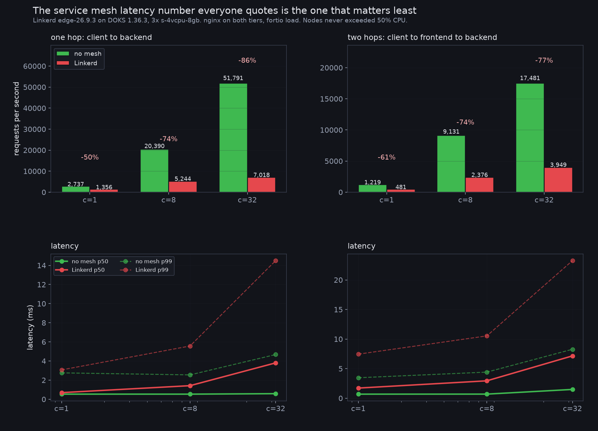

# mesh-tax

What a service mesh actually costs, measured on identical hardware with and without it.

Linkerd edge-26.9.3 on DOKS 1.36.3, three `s-4vcpu-8gb` nodes. nginx on both tiers so
the application is not the bottleneck, `fortio` as the load generator, everything run
from inside the cluster.



## The headline

| | no mesh | Linkerd | change |
|---|---|---|---|
| one hop, c=1, p50 | 0.537 ms | 0.693 ms | **+0.16 ms** |
| one hop, c=1, throughput | 2,737 rps | 1,356 rps | **-50%** |
| one hop, c=32, p50 | 0.585 ms | 3.808 ms | **+3.2 ms** |
| one hop, c=32, throughput | 51,791 rps | 7,018 rps | **-86%** |
| two hops, c=32, p50 | 1.486 ms | 7.160 ms | +5.7 ms |
| two hops, c=32, throughput | 17,481 rps | 3,949 rps | -77% |

The single-connection latency figure, **+0.16 ms per hop**, is the one that gets
quoted and it is honest. It is also the least useful number here, because nobody runs
a service at concurrency 1.

## The nodes were not saturated

The obvious objection is that the proxies ran out of CPU. They did not. Node
utilisation during the meshed `c=32` runs peaked at **50%**, with 4 cores per node:

```
nodes: 42% 48% 17%   (3 of 6 nodes carried the workload)
```

The ceiling is inside the proxy, not on the box.

## The sidecar uses more CPU than the application

Measured under sustained `c=32` load:

| pod | app container | linkerd-proxy | ratio |
|---|---|---|---|
| backend | nginx 91-125m | **340-435m** | ~3.3x |
| frontend | nginx 273-395m | **627-688m** | ~2.0x |
| loadgen | fortio 218-264m | **559-596m** | ~2.4x |

Memory is a different story and much kinder: **12 Mi per proxy**, steady, idle or
loaded.

## It does deliver what it promises

Worth saying plainly, because the numbers above read as an attack and they are not.
Every edge was mutually authenticated with no application changes and no certificates
to manage:

```
SRC          DST        SRC_NS        DST_NS    SECURED
frontend     backend    default       default   √
loadgen      frontend   default       default   √
```

That is the trade. Transparent mTLS on every hop, 12 Mi of memory per pod, and a CPU
and throughput bill that is very much not a rounding error.

## Smaller nodes make it worse, proportionally the same

The first run used `s-2vcpu-4gb` nodes. Both arms are in `out/baseline` and
`out/meshed`. Meshed throughput at `c=32` went from 4,888 rps on 2 cores to 7,018 on
4, but the unmeshed baseline improved too, 33,779 to 51,791, so the relative tax
barely moved. Bigger nodes buy headroom, not a better ratio.

## Reproducing

```bash
doctl kubernetes cluster create meshlab --region fra1 \
  --node-pool "name=pool;size=s-4vcpu-8gb;count=3;auto-scale=false" --wait
kubectl apply -f app.yaml
./bench.sh baseline_big
linkerd install --crds | kubectl apply -f -
linkerd install --set proxyInit.runAsRoot=true | kubectl apply -f -
kubectl annotate namespace default linkerd.io/inject=enabled
kubectl rollout restart deploy/backend deploy/frontend deploy/loadgen
./bench.sh meshed_big
python3 summarise.py
```

About 40 cents of cluster time.

## Caveats

- nginx returning a fixed string is close to the worst case for a mesh, because the
  proxy's work is a large fraction of total work. A service that spends 50 ms in a
  database will show a much smaller relative tax. That is the point of measuring per
  hop rather than end to end, but do not read `-86%` as what your application will see.
- One mesh, one version. Istio with ambient mode has a different architecture and
  would need its own measurement.
- `kubectl top` samples on a lag; the CPU figures are the median of three stable
  samples taken 45 seconds into a 75 second run.

MIT licensed.
